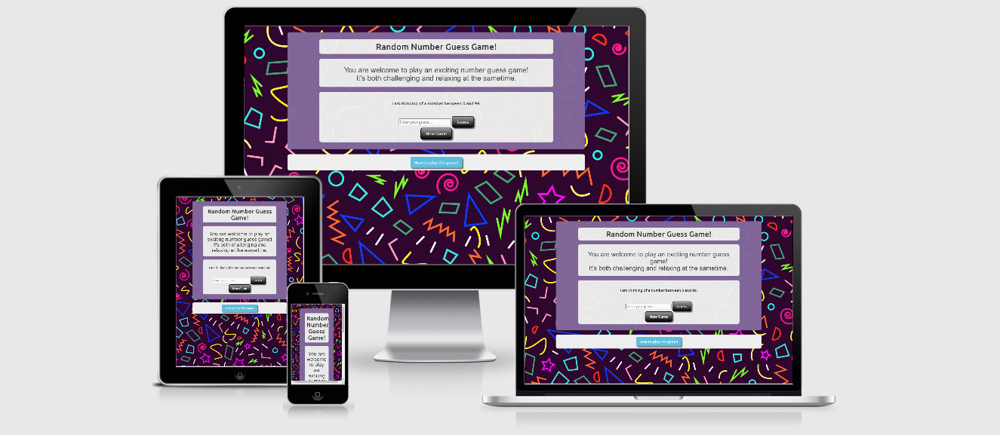

# Random Number Guess Game!

 

***Preamble*** 
This game is my second milestone project. It is a number guess game that allows the player to guess numbers 
between 0 and 99 to search for a mystery number that is only known to the console. The mystery number is picked 
at random by the computer and it can be any number between the range of 0 and 99. It is designed to showcase what I 
have learned so far in HTML, CSS and JavaScript. 
This game is designed for relaxation as it requires attention even though it is a guessing game, if the player is not attentive,  
there is every chance that he/she may not guess the correct number in several attempts. The game is set to be easy to win 
by allowing 10 guess chances. A lower number of guess chances would make the chance of winning limited because lower chances  
means lower opportunity to win, thus discouraging young players.  
This is how the game works: 
The game RANDOMLY picks a number between 0 and 99 that is known only to the Console. 
The player then has a chance of making 10 guesses to unveil the mystery number. 
Each time a guess is made, a message comes up to announce one of the following: 
a) That's lower! Guess: _ (i.e. number of guesses so far) Remaining: _ (usually 10 minus the number of guesses so far made). 
This allows the player to know he/she must guess a higher figure to get the mystery number. 
b) That's higher! Guess: _ Remaining: _ (similar to above, it guides the player on what to guess next). 
c) No more guesses remaining! The number was _. This is an end-of-game message when the player is unable to guess the mystery 
   number. The game can be restarted by refreshing the page.  
d) Yes, its _! It took you _ guess(es). Again, this is an end-of-game message except that the player has guessed the 
   mystery number correctly. The game can be played again by refreshing the page.     

# Table of Contents
1. [User Experience](#user-experience)
2. [Wireframe](#wireframe)
3. [Existing Features](#existing-features) - [Home Page](#home-page)
4. [Technologies Used](#technologies-used)
5. [Testing](#testing)
6. [Deployment](#deployment)
7. [Credits](#credits)
    - [Content](#content)
    - [Media](#media)
    - [Acknowledgment](#acknowledgment)
8. [Disclaimer](#disclaimer)

# User Experience

My main goal is to showcase a part of what I have learned within a short time in JavaScript. I struggled a lot to  
decide on which project to embark upon for this second milestone project as I considered a new website, adding more  
features to my first milestone project, geolocation using International Space Station (ISS) and/or searching for  
facilities such as hotel and accommodation or restaurants or stores using Google and Leaflet APIs and of course games.  
I finally settled for this random-number game targetted at young players to keep them busy. With this game, I was  
able to use the HTML to set the page for the game, use the CSS to style and color the game, and the JavaScript to prepare  
the logic in the game that makes it to set a mystery number, accept guess numbers, compares them with the mystery number  
and returns with a verdict whether the guess number is the same with the mystery number or not. The interesting aspect of  
the game is the selection of the mystery number which is random in all senses.

# Wireframe using Balsamiq
* Sketching
* Drawings
* Features
* Designs

<a href="/workspace/my-second-milestone-project/asset/images/project2 sketch.png">Sketch</a> 
<a href="/workspace/my-second-milestone-project/asset/images/project2 wireframe.png">Wireframe</a>

# Existing Features
There is only 1 key page on this website: * [Home Page](#home-page)

## Home page

The Home page, which is my index.html page is a simple page that contains the following: 

a)  the name/heading of the game 
b)  a welcome message  
c)  the modal button that displays the instructions for playing the game 
d)  the play game area where an input box requests for a number to be guessed and  
    either the enter key of the keyboard or the enter button triggers the result and of course 
e)  the modal message which displays the instructions for playing the game. This message box has two  
    closing buttons. One at the top of the message and another one at the bottom of the message,  
    deliberately designed like this to make life easy for the player.

# Technologies Used

The following technologies were used to create the game:

* Gitpod full template - workspace
* Bootstrap 4.4.1 - used to simplify the structure and to make it responsive
* jquery 3.4.1 - used to reference Javascript modal
* Google Fonts - used to style the website fonts
* W3 School
* Balsamiq - the tool used to create the wireframe
* pixabay.com - used to set the background photo
* Am I Responsive? - to produce the README showcase image

# Testing

## Home Page 

The home page otherwise known as the landing page is broken up into four parts. The main _heading_, the _welcome_  
message, the game _instructions_ modal and the _play-game_ aspect. The welcome message and the play-game parts  
are wrapped in divs so they can be placed in jumbotron for calling extra attention to the information therein.  
The jumbotron uses utility classes for typography and spacing to space content out within the larger container.  
The background of the page is styled with light grey color but buttons styled to render different colors upon  
display, hover and when active.  
This was tested across all the devices and it works nicely across all the devices: phone, iPad laptop and desktop. 

## SPELLING & GRAMMAR

Random Number Guess Game text content and this Readme file has been tested for grammar and spelling mistakes  
through Grammarly.

## The code has been validated using:

#### W3C Mark-up Validation Service and
#### W3C CSS Validation Service

This site has met the objective of creating an online presence with minimalistic design and content, but providing enough  
information and platform to enable fast contact. 
The website has been tested across multiple browsers (Chrome, Safari, Firefox) and different screen sizes  
(Galaxy C5, various iPhones, Huawei, iPad, iPad Pro and laptops) to make sure it is responsive. Bootstrap has been used  
to achieve this. 
All fonts, images and other attributes have been changed accordingly to fit different screen sizes. Media queries have 
been used to make them work.

## Manual testing

#### Summary:

Hours, days and weeks were spent testing Random Number Game throughout its development, which is a testament to the quality 
of the game. The following scenarios were successfully tested:

1. Game behaviour

The game allows only number input as player guess, this is compared with the computer random number which I tagged as 
Mystery number and a report called guessResult is generated in three folds. It is either:
a   The guess is higher or 
b   The guess is lower or 
c   The guess is right. 
These were manually checked to ensure that the codes are working properly.

2. Modal behaviour

This was manually tested to ensure that it renders appropriately. The test reveals that the modal will open but not able  
to close when it is within a container. This was rectified after it was taken out of the container into its separate div 
and class of panel.

3.  Input behaviour

The input type is set to number as a requirement. This too was manually tested to ensure that it does not accept letters 
and symbols. It renders correctly.

# Deployment 

The site was developed using Gitpod full template - workspace to commit and push to GitHub. 
GitHub Pages is a static site hosting service that takes HTML, CSS, and JavaScript files straight 
from a repository on GitHub, optionally runs the files through a build process, and publishes a website.

## The following steps can be taken to access my page from the GitHub repository. 

On Github navigate to my-first-milestone-project 
From the menu at the top click on settings 
Scroll down to the GitHub pages section 
Under the Source, section click on the dropdown menu and select Master Branch as your GitHub Pages publishing source. 
Select save.

## To Clone the Repository
Navigate to the Github remote repository: oakerele-web.github.io 
Click 'Clone or Download'. 
Copy the clone HTTPS or SSH by clicking on the copy button. 
Open Git Bash. 
Change the current working directory to the location where you want the cloned directory to be made. 
Type git clone, and then paste the URL you copied. 
Press Enter. Your local clone will be created. 

***The URL for this project is as follows:***

https://oakerele-web.github.io/my-second-milestone-project/

# Credits 

## Content 

All the text contents in this project are original because they are written by me.  

## Media 

Resources are used from the Bootstrap website including the styling while the font styling is from Font Awesome website.  
The home page is the only page of this website and the background picture for this page was taken from pixabay.com 

## Acknowledgment 

I chose this project from a list of other proposed projects by the Institute. 
Special thanks to Maranatha Ilesanmi - my mentor - for his objective view of this Milestone 2 project which he has helped  
me a lot to review, re-structure and suggested solutions to my pertinent questions. I also thank the tutors of the institutes  
for their assistance whenever I run out of clue. Also, I am grateful to all colleagues in Slack perticularly, the peer review 
section, thank you all. I also want to acknowledge Rex van der Spuy the author of the textbook - Foundation Game Design  
(with HTML5 & JavaScript).  

## Disclaimer 

*The content of this website is for educational purposes only.*
